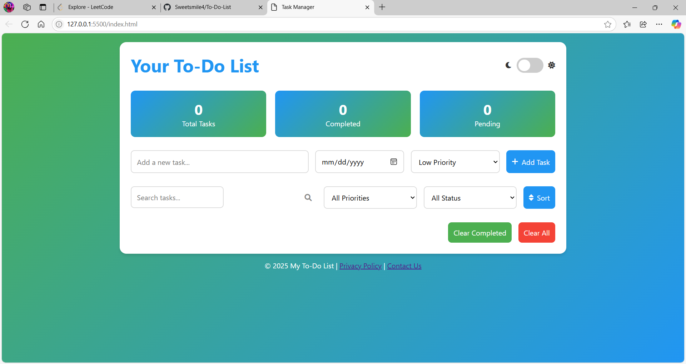

#To-Do-List

To-Do-List 📝
An intuitive and visually appealing Task Manager that helps users efficiently manage their tasks by adding, sorting, and filtering them based on priority and status.

🚀 Features
🟢 Add, Edit, and Delete Tasks
🎯 Set Task Priorities (Low, Medium, High)
✅ Mark Tasks as Completed
🔎 Search and Filter Tasks (by status and priority)
📊 Task Statistics (Total, Completed, and Pending tasks)
🎨 Modern and Responsive UI
🌙 Light/Dark Mode Toggle
🔄 Sort Tasks by Date, Priority, or Status
🗑️ Clear Completed or All Tasks

📸 Screenshots
